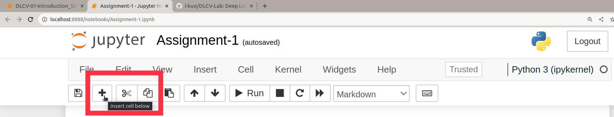
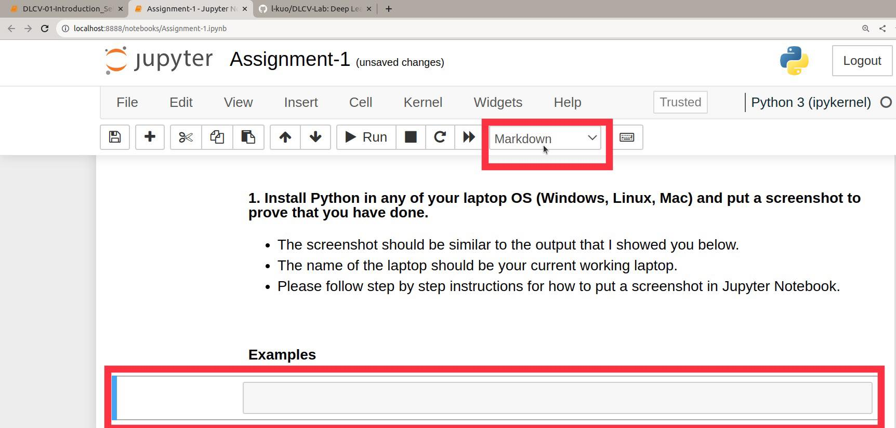
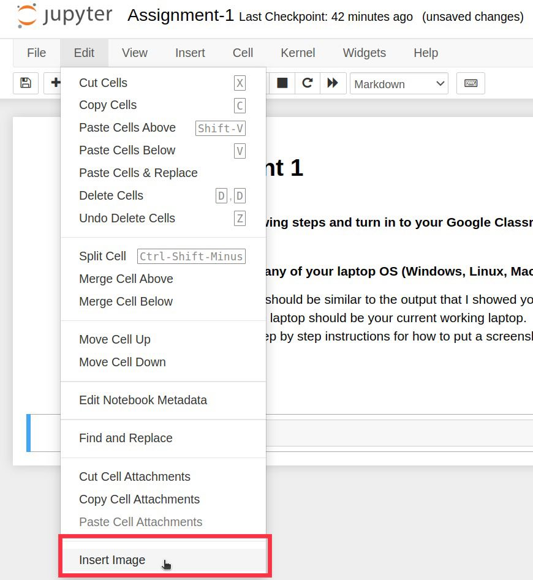
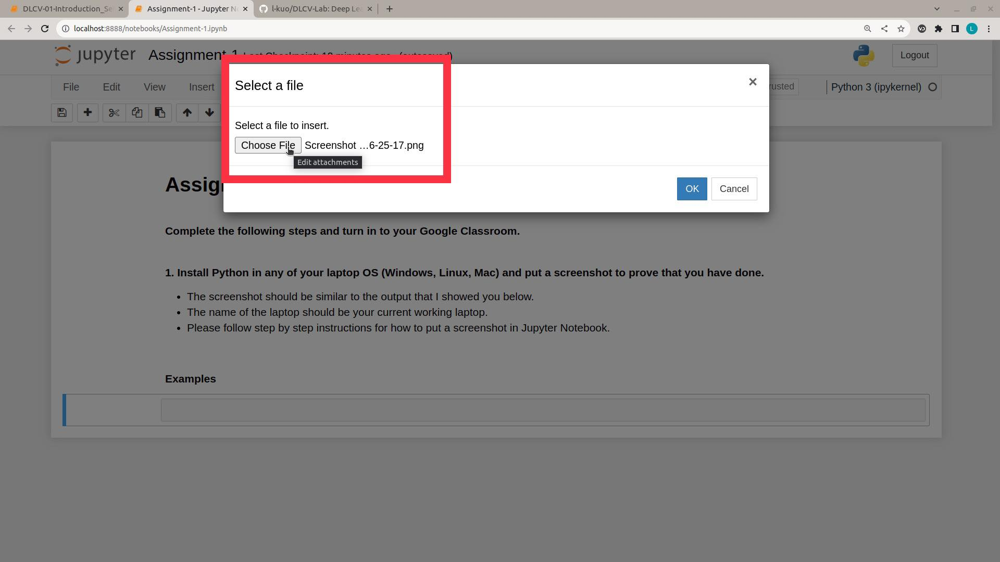
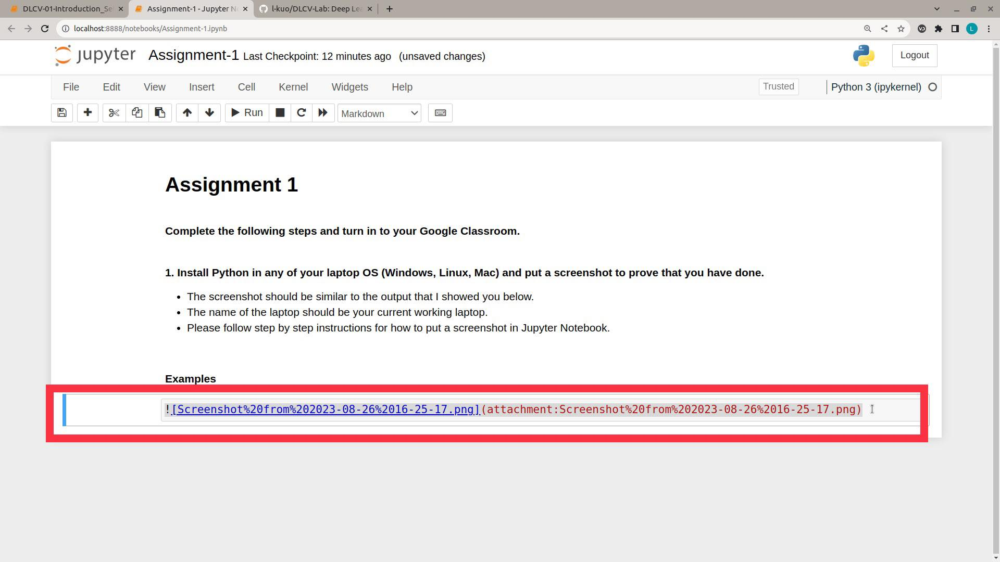

# About Lab  
$\textbf{Course}$  
Deep Reinforcement Learning (Jan 2025)

$\textbf{Lecturer}$  
Assoc.Prof. Dr.Mongkol Ekpanyapong  

$\textbf{Teaching Assistant}$  
Lin Tun Naing  

$\textbf{Programming Language}$  
Python  

$\textbf{Lab Session Outlines}$  
01 - Setup and Introduction to RL  
02 - Markov Decision Process
03 - Monte Carlo Methods
04 - Temporal Difference
05 - Creating Your Own Environment
06 - Deep Q Learning
07 - Function Approximation and DDQN
08 - Actor Critic
09 - PPO and DDPG

$\textbf{Python Basics}$  
- https://github.com/l-kuo/DLCV-Lab (Please learn the first 3 labs)  

$\textbf{References}$  
- https://github.com/Alisa-Kunapinun/Deep-Reinforcement-learning-lab (Dr.Alisa Kunapinun)  
- https://github.com/dsai-asia/RTML/ (Prof.Matthew N. Dailey)  
- http://incompleteideas.net/book/the-book.html (Richard S. Sutton and Andrew G. Barto)
- https://huggingface.co/learn/deep-rl-course/unit0/introduction (Huggingface)
- https://www.youtube.com/watch?v=SupFHGbytvA&list=PL_iWQOsE6TfVYGEGiAOMaOzzv41Jfm_Ps (Robotic AI & Learning Lab at UC Berkeley)  
- https://www.youtube.com/watch?v=TCCjZe0y4Qc&list=PLqYmG7hTraZCRwoyGxvQkqVrZgDQi4m-5 (Google DeepMind)  
- ChatGPT (OpenAI)

### How to Install Git
Please follow the instruction from below link. Complete until the step 3. If you want to understand more about Git, you can complete all steps but not necessary for this lab. 
It is recommended to create the Git account with your own personal email address since you will be using throughout your career even after your degree.  
https://www.freecodecamp.org/news/introduction-to-git-and-github/  

### How to clone a Git Repository
https://git-scm.com/book/en/v2/Git-Basics-Getting-a-Git-Repository

Follow the above link and try cloning my Deep Learning for Computer Vision Lab Repository.  
https://github.com/l-kuo/DRL_Lab

### How to put a screenshot in Jupyter Notebook Markdown
The following steps are the easiest way to put a screenshot in your Jupyter Markdown cell.  
**This will be useful for your assignment submission using Markdown**  

##### Step1
- Add a new cell at a location where you want to put the screenshot. Notice that you have to select an existing cell before adding. A new cell will appear just below the cell you selected.

   

##### Step2
- Select the new cell and change the type of the cell by choosing "Markdown" on the task bar dropdown.

   

##### Step3
- Under the "Edit" tab, choose the "Insert Image" while selecting the cell.

   

##### Step4
- Click on "Choose File" and select your screenshot from your local directory. Then click "OK".

   

##### Step5
- When you have selected the screenshot image, the script inside the red rectangle will appear automatically. Once you run the cell, you will get the screenshot image shown in your markdown file.

   
